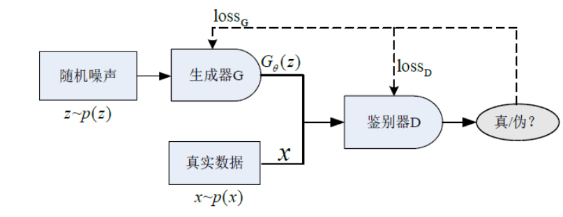
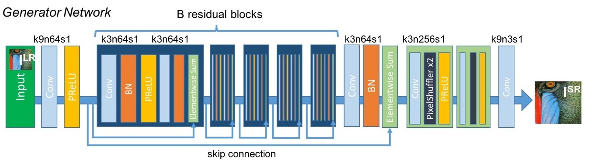
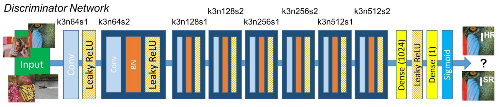
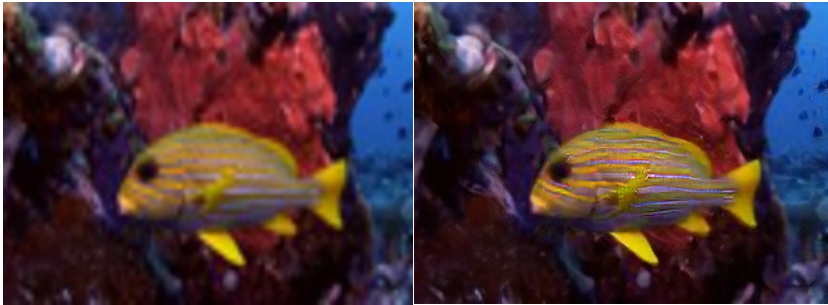
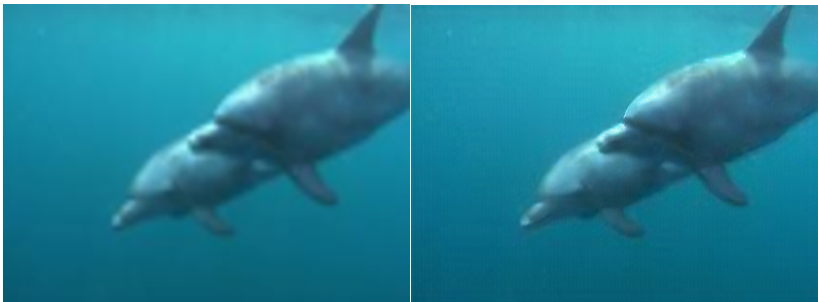
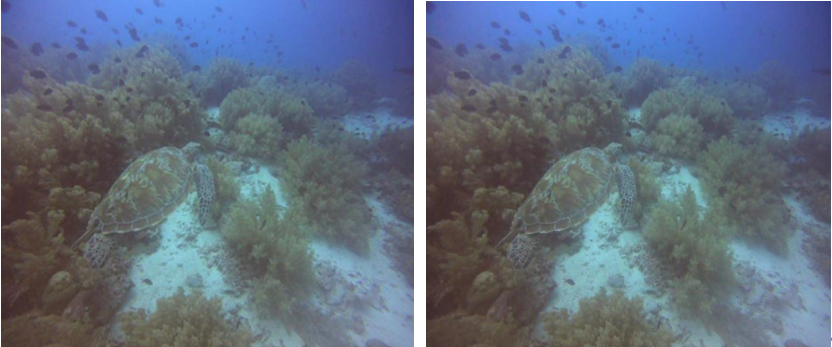
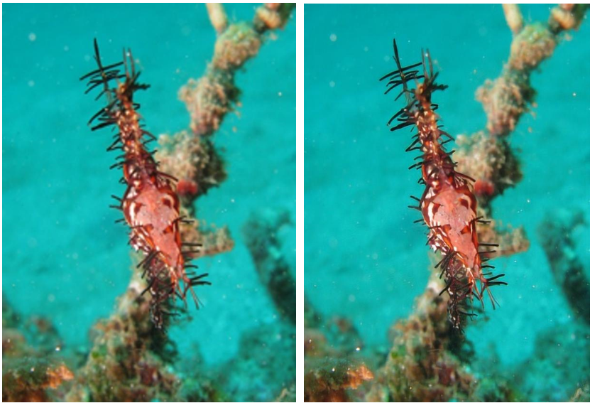
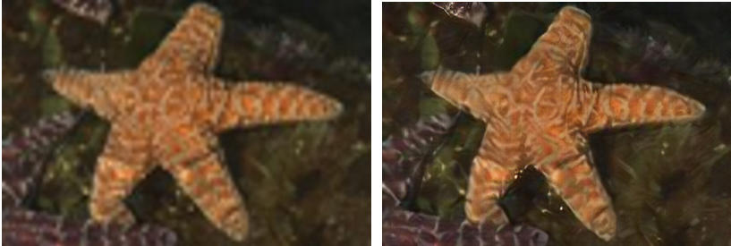
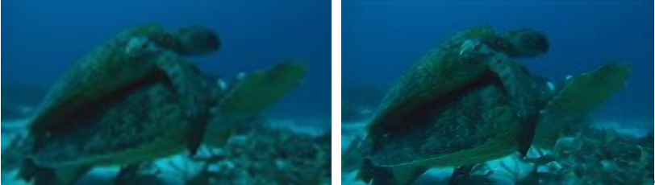
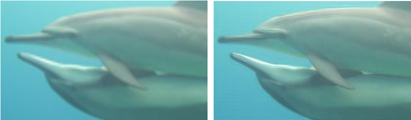

## LZU深度学习课程设计2022-Keras-SRGAN

### 利用Keras中的生成对抗网络实现的水下摄像机单幅图像超分辨重建

## 问题陈述：
    针对水下图像质量降低导致目标检测准确率下降的情况，利用生成对抗网络（GAN）完成用于图像超分辨率重建（SR）的生成对抗网络（SRGAN）算法增强低分辨率图像来产生高分辨率的图像。

## 网络架构:



## 生成器和鉴别器网络:

生成器网络结构：



鉴别器网络结构：



​    

## 网络训练细节:
```
我们通过下载VGG模型构建生成器D和判别器G，根据数据集训练判别器D和生成器G。每训练五次保留一次模型，模型处理结束后，通过对模型输入模糊化处理后的图片，输出VGG处理后的图片，二者对比即可观察出训练成果。首先，低分辨率图像经过卷积+PReLU激活函数；图像再经过16个残差网络结构；再完成上采样，放大图像的长宽，放大图像分辨率。我们选用了Adam优化器最小化损失函数，将其参数设置为β=0.9。我们将训练学习率设置为1e-3。通过重复训练生成器网络和判别器网络，直至判别器无法判别重建后的图像是否为真，训练结束。
```

## 环境部署:
    本实验基于华为云ModelArts平台开展研究
    编程环境：python3.7
    深度学习框架：tensorFlow1.13-cuda10.0-cudnn7-ubuntu18.04
    规格：GPU：1*P100(16GB)|CPU：8核 64GB

## 数据集:

    共选取了两种数据集进行比较。数据集1选自2020年未来杯水下图像分类比赛的初赛数据集，数据集2为人工建立，仅涉及较少部分的水下图像，在数据集二中前2000张用作训练集使用，后20张用于测试集使用。

## 实验结果快速复现:

    将input中的样例图像保存在根目录下：
    *对单张图片进行对比
    python predict_for_compare.py
    该预测文件可用于获得对比的图片，会保存bicbic上采样和srgan上采样的结果
    *对单张图片进行预测
    python predict.py
    该预测文件可直接获得预测结果，运行结果保存在根目录，保存文件为predict_srgan.png

## 输出结果:

下面是具体的SRGAN重建图像实例：















## 实验过程中经验总结：

    * GAN's有时很难训练。网络有时会很深，但使用残余块可以使它更容易。
    * 使用感知损失会使得复杂的事情变得简单。同样的感知损失可以用于图像风格转换和照片现实风格转换。
    * 最好使用相同宽度和高度的图像。
    * 使用GPU进行训练，否则将需要几个月的时间来训练（否则会耗尽内存）。

## 参考文献:

    [1].	于宁,徐涛,王庆龙,谭林涛,李凯,贾平.智慧渔业发展现状与对策研究[J].中国渔业经济,2021,39(01):13-21.
    [2].	于国庆,杨东瀚,睢丙东,李宏哲.基于SRGAN改进的人脸图像超分辨率重构算法研究[J].科技风,2022(05):66-68.DOI:10.19392/j.cnki.1671-7341.202205021.
    [3].	李钰,杨道勇,刘玲亚,王易因.利用生成对抗网络实现水下图像增强[J].上海交通大学学报,2022,56(02):134-142.DOI:10.16183/j.cnki.jsjtu.2021.075.
    [4].	D. Akkaynak, T. Treibitz, A revised underwater image formation, in: Proc. IEEEInt. Conf. Comput. Vis. Pattern Recognit. (CVPR), IEEE, 2018, pp. 6723–6732.
    [5].	W. Wang, Y. Xu, J. Shen, S. Zhu, Attentive fashion grammar network for fashionlandmark detection and clothing category classification, in: Proc. IEEE Int. Conf.Comput. Vis. Pattern Recognit. (CVPR), IEEE, 2018, pp. 4271–4280.
    [6].	王鹏. 基于深度学习的水下图像增强算法研究[D].南京信息工程大学,2021.DOI:10.27248/d.cnki.gnjqc.2021.000116.
    [7].	李旭. 基于生成对抗网络的超分辨率图片重构研究[D].北京邮电大学,2020.DOI:10.26969/d.cnki.gbydu.2020.000864.	
    [8].	邢晶晶. 基于生成对抗网络的水下图像增强方法研究[D].上海海洋大学,2021.DOI:10.27314/d.cnki.gsscu.2021.000013.


​               